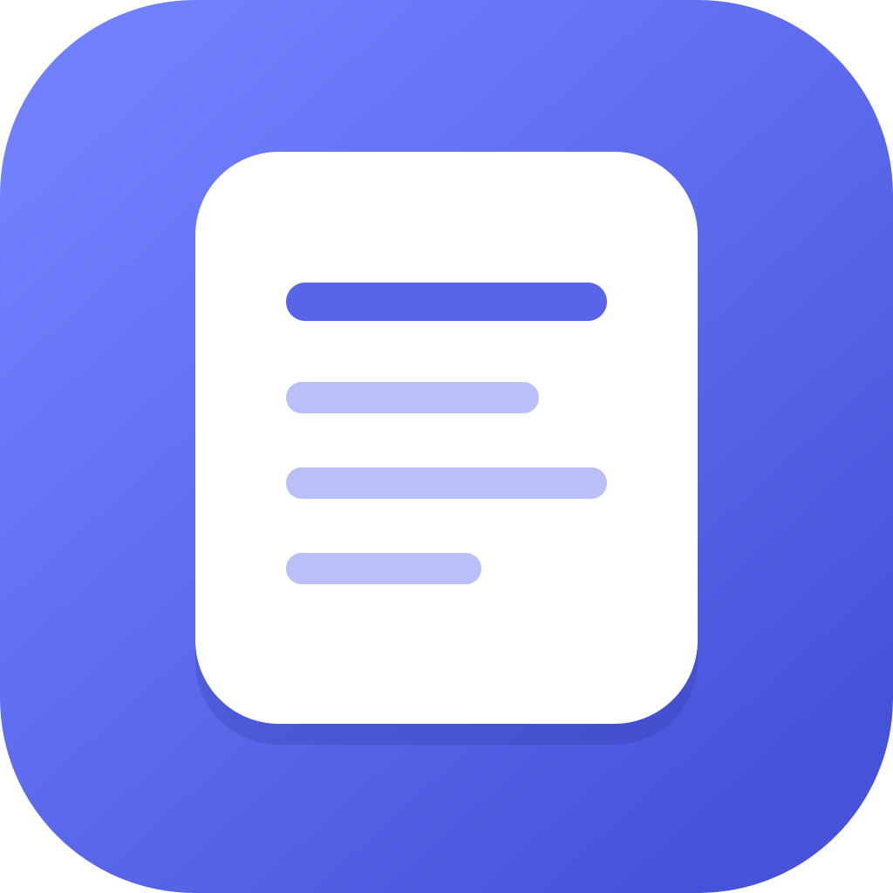

<p align="center">
  
</p>

<h1 align="center">Notluk</h1>

<p align="center">
  Mac için sade, hızlı ve ortak çalışmaya hazır not uygulaması.
</p>

<p align="center">
  <a href="https://github.com/UmutKaanTorun/notluk/releases/latest/download/Notluk-0.1.0-arm64.dmg"><strong>Apple Silicon DMG indir</strong></a>
  ·
  <a href="https://github.com/UmutKaanTorun/notluk/releases/latest/download/Notluk-0.1.0-x64.dmg"><strong>Intel DMG indir</strong></a>
  ·
  <a href="https://github.com/UmutKaanTorun/notluk/releases/latest">Son sürüm</a>
</p>


Notluk, yerel demo moduyla hemen açılan; Supabase bağlandığında e-posta ile şifresiz giriş, çalışma alanı üyeliği ve cihazlar arası canlı güncelleme sunan bir Electron uygulamasıdır.

## İndir

- [Apple Silicon için DMG](https://github.com/UmutKaanTorun/notluk/releases/latest/download/Notluk-0.1.0-arm64.dmg)
- [Intel Mac için DMG](https://github.com/UmutKaanTorun/notluk/releases/latest/download/Notluk-0.1.0-x64.dmg)

macOS uygulama imzalanmamış derlemeyi açarken uyarı gösterebilir. Dosyayı sağ tıklayıp **Aç** seçeneğini kullanın.

## Özellikler

- Kişisel ve ortak çalışma alanları
- Not oluşturma, düzenleme, arama, favorileme ve çöp kutusu
- Zengin metin araçları ve otomatik kayıt
- Açık, koyu ve sistem teması
- İnternet veya hesap gerektirmeyen yerel demo modu
- Supabase ile e-posta üzerinden şifresiz giriş
- E-posta adresine göre üyelik ve görüntüleme/düzenleme yetkileri
- Supabase Realtime ile cihazlar arası canlı güncelleme
- macOS Mail ile hazır davet mesajı oluşturma
- Apple Silicon ve Intel için DMG derleme yapılandırması

## Ekran Görüntüleri

| Açık tema | Koyu tema |
| --- | --- |
|  |  |

## Yerel Geliştirme

Gereksinimler:

- Node.js 22+
- npm
- macOS üzerinde DMG üretmek için Xcode Command Line Tools

```bash
npm install
npm run dev
```

Tarayıcıda yalnızca arayüzü çalıştırmak için:

```bash
npm run dev:web
```

Test ve üretim derlemesi:

```bash
npm test
npm run build
```

## Supabase Kurulumu

1. Supabase üzerinde yeni bir proje oluşturun.
2. `supabase/schema.sql` dosyasını Dashboard -> SQL Editor içinde çalıştırın.
3. Authentication -> URL Configuration -> Redirect URLs alanına `notluk://auth/callback` ekleyin.
4. Uygulamada Ayarlar -> Bulut ve ortak çalışma bölümünü açın.
5. Project URL ve publishable key değerlerini girin.
6. E-postaya gelen bağlantı ile giriş yapın.

`sb_publishable_...` anahtarı istemci uygulamalarında kullanılmak üzere tasarlanmıştır ve derlenmiş masaüstü uygulamasında bulunabilir. `sb_secret_...` veya `service_role` anahtarını hiçbir zaman uygulamaya, GitHub'a ya da sohbetlere eklemeyin.

## DMG Oluşturma

DMG yalnızca macOS üzerinde üretilebilir:

```bash
npm ci
npm test
npm run build:mac
```

Oluşan dosyalar `release/` klasörüne yazılır:

- `Notluk-0.1.0-arm64.dmg`
- `Notluk-0.1.0-x64.dmg`

Hazır DMG dosyaları için [son sürüm sayfasını](https://github.com/UmutKaanTorun/notluk/releases/latest) kullanın.

## İmzalama Notu

Yayınlanan DMG dosyaları imzasızdır. Apple Developer hesabıyla imzalı ve noter onaylı dağıtım yapmak için sertifika ve App Store Connect anahtarlarını yalnızca yerel makinede veya güvenli CI secret alanında kullanın; kaynak koda eklemeyin.

## Ortak Düzenleme Davranışı

Not değişiklikleri yaklaşık 600 ms bekleme sonrası kaydedilir ve Supabase Realtime ile diğer kullanıcılara iletilir. Bu MVP sürümü son kaydı esas alır. Karakter seviyesinde eşzamanlı, çakışmasız düzenleme için sonraki sürümde Yjs/CRDT katmanı eklenebilir.

## Lisans

MIT. Ayrıntılar için [LICENSE](LICENSE) dosyasına bakın.
