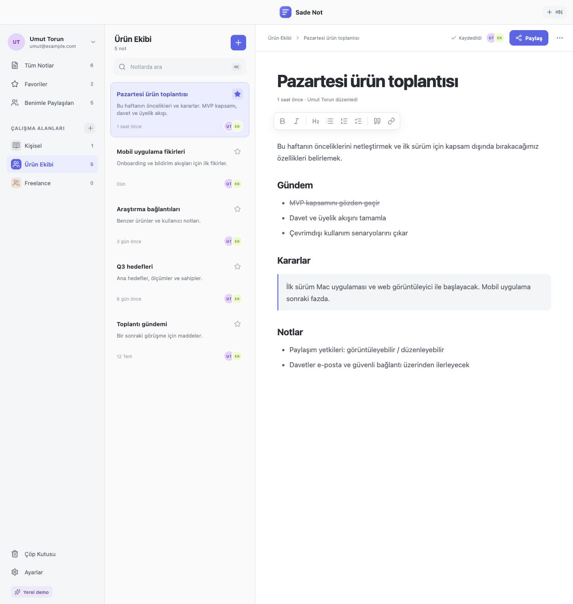
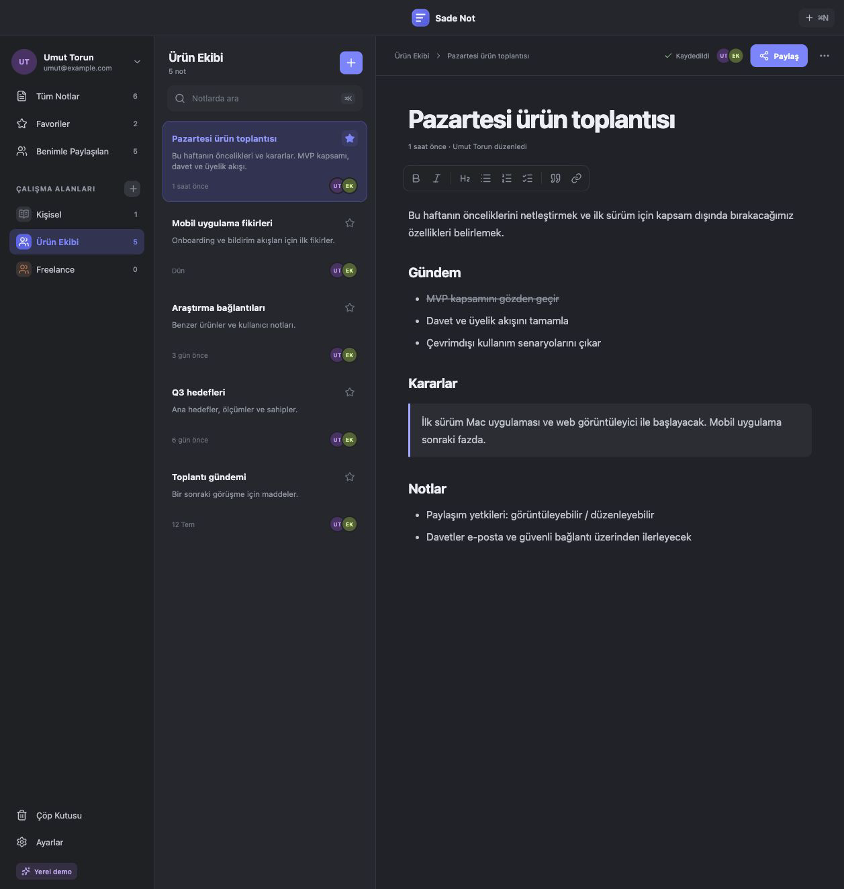

# Sade Not

Mac için sade, hızlı ve ortak çalışmaya hazır not uygulaması.



Sade Not, yerel demo moduyla hemen açılan; Supabase bağlandığında e-posta ile şifresiz giriş, çalışma alanı üyeliği ve cihazlar arası canlı güncelleme sunan bir Electron uygulamasıdır.

## Özellikler

- Kişisel ve ortak çalışma alanları
- Not oluşturma, düzenleme, arama, favorileme ve çöp kutusu
- Zengin metin araçları ve otomatik kayıt
- Açık, koyu ve sistem teması
- İnternet veya hesap gerektirmeyen yerel demo modu
- Supabase ile e-posta üzerinden şifresiz giriş
- E-posta adresine göre üyelik ve görüntüleme/düzenleme yetkileri
- Supabase Realtime ile cihazlar arası canlı güncelleme
- macOS Mail ile hazır davet mesajı oluşturma
- Apple Silicon ve Intel için DMG derleme yapılandırması

## Ekran Görüntüleri

| Açık tema | Koyu tema |
| --- | --- |
|  |  |

## Yerel Geliştirme

Gereksinimler:

- Node.js 22+
- npm
- macOS üzerinde DMG üretmek için Xcode Command Line Tools

```bash
npm install
npm run dev
```

Tarayıcıda yalnızca arayüzü çalıştırmak için:

```bash
npm run dev:web
```

Test ve üretim derlemesi:

```bash
npm test
npm run build
```

## Supabase Kurulumu

1. Supabase üzerinde yeni bir proje oluşturun.
2. `supabase/schema.sql` dosyasını Dashboard -> SQL Editor içinde çalıştırın.
3. Authentication -> URL Configuration -> Redirect URLs alanına `sadenot://auth/callback` ekleyin.
4. Uygulamada Ayarlar -> Bulut ve ortak çalışma bölümünü açın.
5. Project URL ve publishable key değerlerini girin.
6. E-postaya gelen bağlantı ile giriş yapın.

`sb_publishable_...` anahtarı istemci uygulamalarında kullanılmak üzere tasarlanmıştır ve derlenmiş masaüstü uygulamasında bulunabilir. `sb_secret_...` veya `service_role` anahtarını hiçbir zaman uygulamaya, GitHub'a ya da sohbetlere eklemeyin.

## DMG Oluşturma

DMG yalnızca macOS üzerinde üretilebilir:

```bash
npm ci
npm test
npm run build:mac
```

Oluşan dosyalar `release/` klasörüne yazılır:

- `Sade-Not-0.1.0-arm64.dmg`
- `Sade-Not-0.1.0-x64.dmg`

GitHub Actions kullanmak için **Build macOS DMG** iş akışını manuel çalıştırın veya `main` dalına push yapın. DMG dosyaları iş akışı sonunda `Sade-Not-macOS` artifact'i olarak sunulur.

### Tek Tıkla GitHub'a Yükleme

Mac üzerinde `GitHuba-Yukle.command` dosyasını açabilirsiniz. Yardımcı dosya GitHub oturumunu tarayıcıda doğrular, kaynakları `UmutKaanTorun/sade-not-public` deposunun `main` dalına gönderir, **Build macOS DMG** iş akışını takip eder ve tamamlanan DMG dosyalarını `release-from-github/` klasörüne indirir.

macOS dosyayı doğrudan açmazsa sağ tıklayıp **Aç** seçeneğini kullanın veya Terminal'de şu komutu çalıştırın:

```bash
bash GitHuba-Yukle.command
```

GitHub parolanızı, token'inizi veya Apple sertifikalarınızı bu dosyaya yazmayın.

## İmzalı ve Noter Onaylı DMG

Apple Developer hesabınız varsa GitHub deposunda **Settings -> Secrets and variables -> Actions** bölümüne şu secret değerlerini ekleyin:

- `MAC_CERTIFICATE_P12_BASE64`: Developer ID Application sertifikasının `.p12` çıktısı, base64 biçiminde
- `MAC_CERTIFICATE_PASSWORD`: `.p12` dışa aktarma parolası
- `APPLE_API_KEY_P8_BASE64`: App Store Connect API anahtarının `.p8` dosyası, base64 biçiminde
- `APPLE_API_KEY_ID`: App Store Connect Key ID
- `APPLE_API_ISSUER`: App Store Connect Issuer ID
- `APPLE_TEAM_ID`: Apple Developer Team ID

Ardından GitHub Actions içinden **Release Signed macOS DMG** iş akışını çalıştırın. Bu akış uygulamayı Developer ID ile imzalar, Apple noter kontrolüne gönderir ve Intel/Apple Silicon DMG dosyalarını artifact olarak sunar.

## Ortak Düzenleme Davranışı

Not değişiklikleri yaklaşık 600 ms bekleme sonrası kaydedilir ve Supabase Realtime ile diğer kullanıcılara iletilir. Bu MVP sürümü son kaydı esas alır. Karakter seviyesinde eşzamanlı, çakışmasız düzenleme için sonraki sürümde Yjs/CRDT katmanı eklenebilir.

## Lisans

MIT. Ayrıntılar için [LICENSE](LICENSE) dosyasına bakın.
